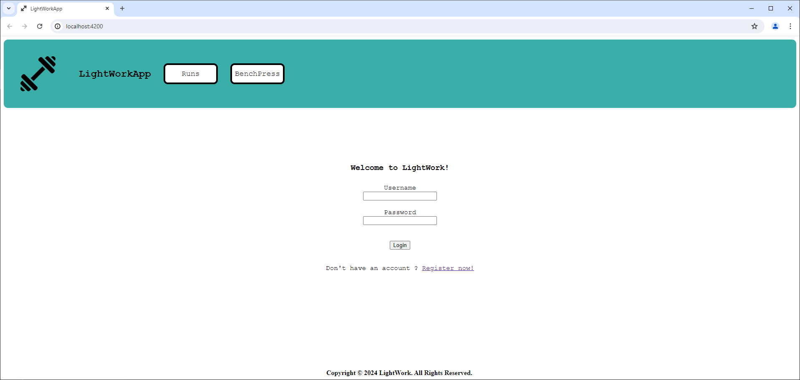
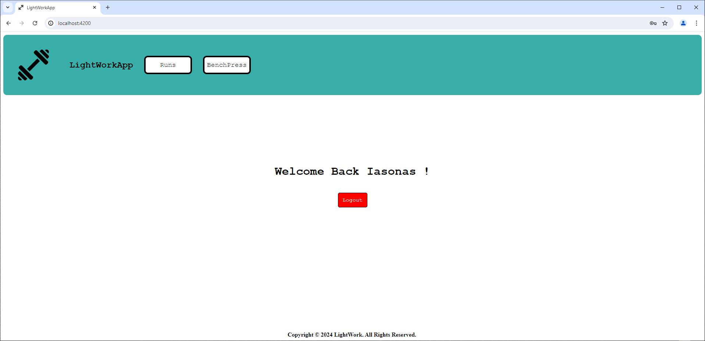
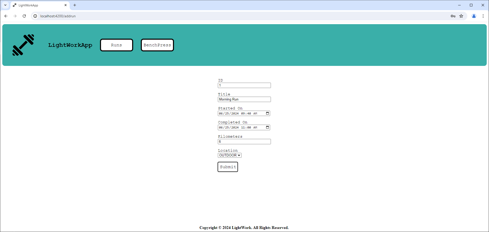
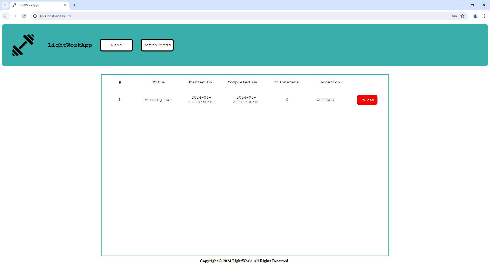

# LightWork
## About the project
LightWork is a web app that allows you to keep track of your workouts created using the Spring Boot framework for the backend and Angular for the front end of the application! The apps allows the user to add and view his workouts in a user friendly environment. The data is stored in a local H2 database. The reason i created this project is in order to better understand the usage of Springboot for the developement of API Services and the flexibility that a framework such as Angular has to provide for the frontend.

## 

A user has to log in first before adding his workouts. 

The user then will be able to either view or add his workouts.

**Only** the workouts of the user are desplayed and he can delete them if he wants to.

## Technologies used in this project:

- Java Spring Boot Framework
- JavaScript Angular Framework

